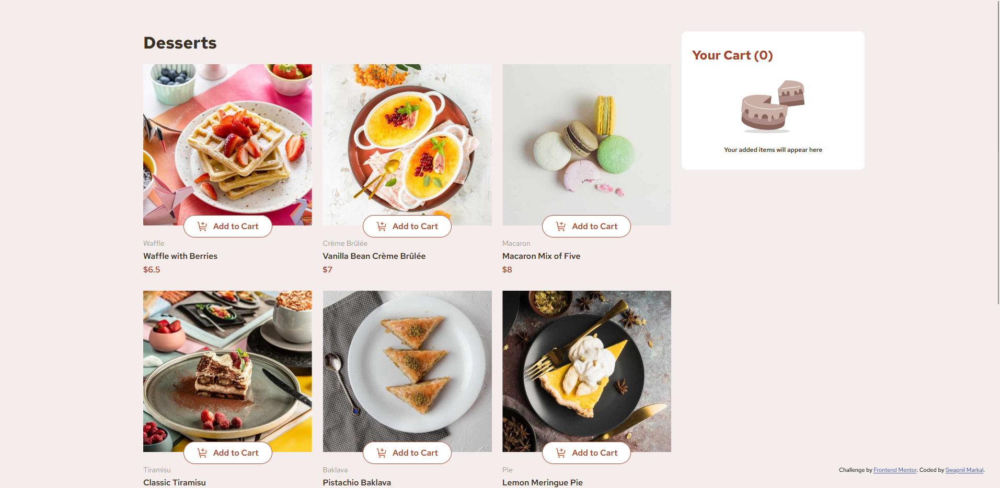

# Frontend Mentor - Product list with cart solution

This is a solution to the [Product list with cart challenge on Frontend Mentor](https://www.frontendmentor.io/challenges/product-list-with-cart-5MmqLVAp_d). Frontend Mentor challenges help you improve your coding skills by building realistic projects.
- [Challenge File](Challenge.md)
- [Link to style guide](style-guide.md)
## Table of contents

- [Overview](#overview)
  - [The challenge](#the-challenge)
  - [Screenshot](#screenshot)
  - [Links](#links)
- [My process](#my-process)
  - [Built with](#built-with)
  - [What I learned](#what-i-learned)
  - [Continued development](#continued-development)
- [Author](#author)

**Note: Delete this note and update the table of contents based on what sections you keep.**

## Overview

### The challenge

Users should be able to:

- Add items to the cart and remove them
- Increase/decrease the number of items in the cart
- See an order confirmation modal when they click "Confirm Order"
- Reset their selections when they click "Start New Order"
- View the optimal layout for the interface depending on their device's screen size
- See hover and focus states for all interactive elements on the page

### Screenshot

### Links

- Solution URL: [Github Code](https://github.com/Cjmax10/product-list-with-cart)
- Live Site URL: [Live URL](https://cjmax10.github.io/product-list-with-cart/)

## My process

### Built with

- Semantic HTML5 markup
- CSS custom properties
- Flexbox
- CSS Grid
- Javascript

### What I learned

Manipulating DOM using Javascript. Traversing through elements using javascript. Storing items to localstorage and fetching to display it to the website.

### Continued development

Have to optimise code. This code has lots of code repetition. Have to fix that in future.

## Author

- Website - [Swapnil Markal](https://cjmax10.github.io/Portfolio/)
- Frontend Mentor - [@Cjmax10](https://www.frontendmentor.io/profile/Cjmax10)